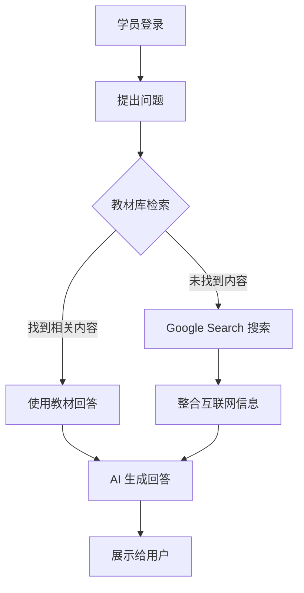
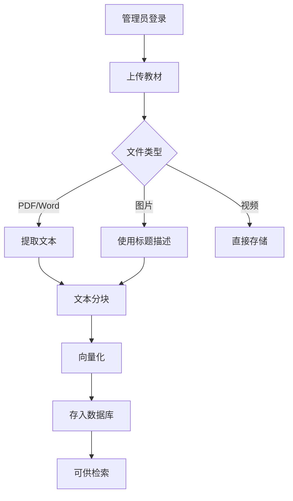

# 普拉提训练助手 - 功能说明

## 核心功能

### 1. 智能知识检索系统

#### RAG (检索增强生成) 优先
- 当教材库中有相关内容时，AI 优先使用已上传的教材回答
- 支持文档类型：PDF、Word、图片
- 自动文档解析和向量化存储
- 语义搜索，相似度匹配

#### 互联网搜索 Fallback
- **新功能**：当教材库中没有找到相关内容时，AI 自动使用 Google Search 搜索互联网信息
- 使用 Gemini 2.0 的 Search Grounding 功能
- 可以搜索最新的普拉提视频、教程、研究等
- 提供准确的互联网资源引用

### 2. 用户体系

#### 学员角色
- 注册/登录
- 与 AI 教练对话
- 查看推荐视频和练习

#### 管理员角色
- 上传教材（视频、图片、PDF、Word）
- 管理教材库
- 查看已处理的知识块

### 3. 安全防护

- **速率限制**：30次请求/分钟
- **输入验证**：
  - 长度限制（2000字符）
  - Prompt 注入防护
  - 恶意模式检测
- **身份验证**：基于 NextAuth.js 的会话管理

### 4. AI 能力

- **专业教练 Prompt**：温柔、专业、鼓励性语气
- **Markdown 格式输出**：清晰的列表、加粗重点
- **多模态支持**：理解文本、图片描述
- **上下文理解**：连续对话记忆

## 工作流程

### 学员使用流程



### 管理员工作流程



## 技术栈

| 层级 | 技术 |
|------|------|
| 前端 | Next.js 16 + React 19 + Tailwind CSS 4 |
| 认证 | NextAuth.js v5 |
| 数据库 | SQLite + Prisma ORM |
| AI | Google Gemini 2.0 Flash Exp |
| 向量搜索 | Text Embedding 004 |
| 文档解析 | pdf-parse + mammoth |

## 环境变量配置

```env
# Google AI
GOOGLE_GENERATIVE_AI_API_KEY=your_api_key_here

# NextAuth
AUTH_SECRET=your_secret_key
AUTH_URL=http://localhost:3000

# Database
DATABASE_URL="file:./dev.db"
```

## 测试账户

| 角色 | 邮箱 | 密码 |
|------|------|------|
| 管理员 | admin@pilates.com | admin123 |
| 学员 | user@pilates.com | user123 |

## 使用示例

### 场景 1：有教材内容
**用户问**：如何正确收紧核心？
**AI 回答**：基于管理员上传的《核心训练指南.pdf》中的内容回答

### 场景 2：无教材内容（新功能）
**用户问**：2024年最新的普拉提研究有哪些？
**AI 回答**：使用 Google Search 搜索最新信息并回答

### 场景 3：视频请求
**用户问**：有没有百式呼吸的教学视频？
**AI 回答**：
1. 如果管理员上传过相关视频，推荐本地视频
2. 如果没有，搜索 YouTube 等平台的教学视频

## 开发命令

```bash
# 安装依赖
npm install

# 初始化数据库
npx prisma migrate dev

# 创建测试用户
npm run db:seed

# 启动开发服务器
npm run dev

# 查看数据库
npm run db:studio
```

## 未来改进方向

1. **图片识别**：集成 Gemini Vision API 识别教材图片中的动作
2. **语音对话**：支持语音输入和输出
3. **个性化训练计划**：基于用户历史生成定制计划
4. **社区功能**：学员间交流分享
5. **进度追踪**：记录训练历史和进展
